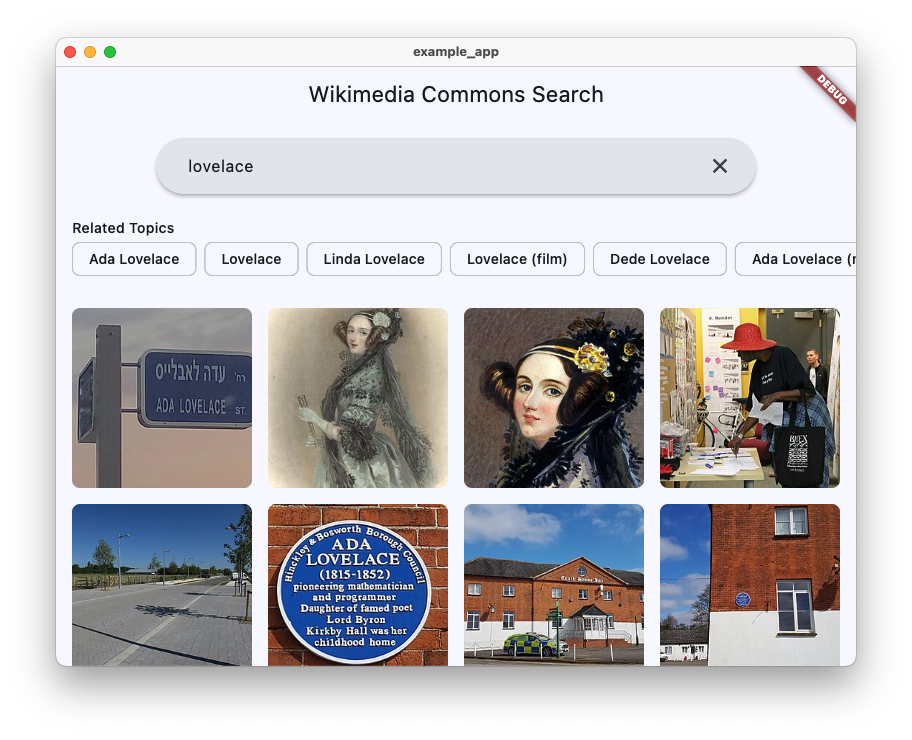

# Wikimedia Commons Search

[](https://pub.dev/packages/wikimedia_commons_search)

A Dart library for searching Wikipedia topics and retrieving associated Wikimedia Commons images.

## ⚠️ Licensing Notice

This library is a tool for accessing Wikimedia content and does not handle content licensing. When using content from Wikipedia or Wikimedia Commons, you must observe and comply with Wikimedia's licensing terms. Different content pieces may have different licenses.

For more information, visit:
- [Wikimedia Commons Licensing](https://commons.wikimedia.org/wiki/Commons:Licensing)
- [Wikimedia Terms of Use](https://foundation.wikimedia.org/wiki/Terms_of_Use)

## Installation

```yaml
dependencies:
  wikimedia_commons_search: ^1.0.0
```

Then run:
```bash
dart pub get
```

## Usage

### Basic Example

```dart
import 'package:wikimedia_commons_search/wikimedia_commons_search.dart';

void main() async {
  final search = WikimediaCommonsSearch();

  try {
    // Search for images related to a topic
    final images = await search.searchImages('Eiffel Tower');
    
    for (final image in images) {
      print('Title: ${image.title}');
      print('URL: ${image.url}');
      print('License: ${image.license}');
      print('Description: ${image.description}');
      print('---');
    }
  } on WikimediaCommonsException catch (e) {
    print('Error: ${e.message}');
  } finally {
    search.dispose();
  }
}
```

## Screenshots

Here's how the library looks in action using the bundled example Flutter app (see [example/example_app/README.md](example/example_app/README.md)):




### Advanced Usage

You can also search for topics first and then get images for specific topics:

```dart
final search = WikimediaCommonsSearch();

try {
  // Search for Wikipedia topics
  final topics = await search.searchTopics('Eiffel Tower');
  
  // Print topic information
  for (final topic in topics) {
    print('Topic: ${topic.title}');
    print('Description: ${topic.description}');
    
    // Get images for this specific topic
    final images = await search.getTopicImages(topic.id);
    print('Found ${images.length} images');
    
    for (final image in images) {
      print('- ${image.title}');
    }
    print('---');
  }
} finally {
  search.dispose();
}
```

## Features

- Search for images related to Wikipedia topics
- Browse and filter high-quality Wikimedia Commons images
- Get detailed image metadata:
  - Full resolution URL and thumbnail
  - Description and attribution
  - License information
  - Technical details (dimensions, file type)
- Automatic filtering of utility images (flags, icons, logos)
- Smart image sorting (non-SVG before SVG, larger files first)
- Comprehensive error handling with custom exceptions

## Error Handling

The library provides several exception types for different error cases:
- `WikimediaNoResultsException`: No topics found for the search query
- `WikimediaNoImagesException`: No suitable images found for the topic
- `WikimediaApiException`: API request failed or general errors
- `ResponseParsingException`: Failed to parse API response
- `DisposedException`: Attempt to use a disposed instance

## License

This library is licensed under the MIT License - see the LICENSE file for details.

Note: This license applies to the library code only, not to the content retrieved from Wikimedia Commons or Wikipedia.