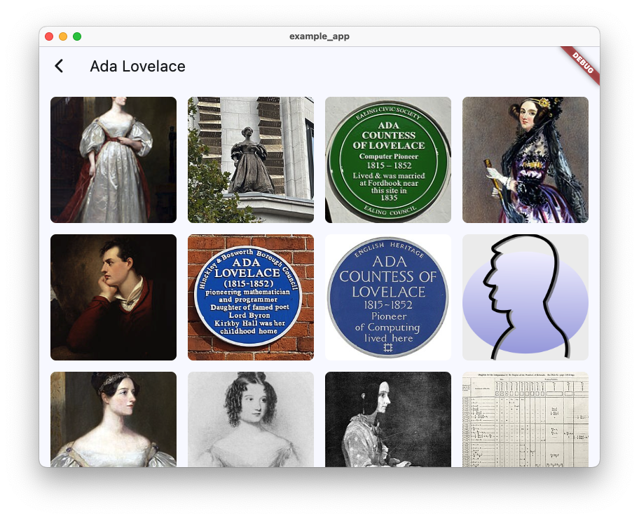

# Wikimedia Commons Search

[](https://pub.dev/packages/wikimedia_commons_search)

A Dart library for searching Wikipedia topics and retrieving associated Wikimedia Commons images.
wikimedia_commons_search is developed and used by [Faabul Live Quizzes][faabul_link]

## ⚠️ Licensing Notice

This library is a tool for accessing Wikimedia content and does not handle content licensing. When using content from Wikipedia or Wikimedia Commons, you must observe and comply with Wikimedia's licensing terms. Different content pieces may have different licenses.

For more information, visit:
- [Wikimedia Commons Licensing](https://commons.wikimedia.org/wiki/Commons:Licensing)
- [Wikimedia Terms of Use](https://foundation.wikimedia.org/wiki/Terms_of_Use)

## Installation

```yaml
dependencies:
  wikimedia_commons_search: ^1.0.0
```

Then run:
```bash
dart pub get
```

## Usage

### Basic Example

```dart
import 'package:wikimedia_commons_search/wikimedia_commons_search.dart';

void main() async {
  final commons = WikimediaCommons();

  try {
    // Search for images related to a topic
    final images = await commons.searchImages('Eiffel Tower');
    
    for (final image in images) {
      print('Title: ${image.title}');
      print('URL: ${image.url}');
      print('License: ${image.license}');
      print('Description: ${image.description}');
      print('---');
    }
  } on WikimediaCommonsException catch (e) {
    print('Error: ${e.message}');
  } finally {
    commons.dispose();
  }
}
```

## Screenshots

Here's how the library looks in action using the bundled example Flutter app (see [example/example_app/README.md](example/example_app/README.md)):





### Advanced Usage

You can also search for topics first and then get images for specific topics:

```dart
final commons = WikimediaCommons();

try {
  // Search for Wikipedia topics
  final topics = await commons.searchTopics('Eiffel Tower');
  
  // Print topic information
  for (final topic in topics) {
    print('Topic: ${topic.title}');
    print('Description: ${topic.description}');
    
    // Get images for this specific topic
    final images = await commons.getTopicImages(topic.id);
    print('Found ${images.length} images');
    
    for (final image in images) {
      print('- ${image.title}');
    }
    print('---');
  }
} finally {
  commons.dispose();
}
```

### Thumbnail Generation

```dart
final thumbUrl = WikimediaCommons.getThumbnailUrl(
  'https://upload.wikimedia.org/wikipedia/commons/a/a5/Example.jpg',
  width: 800,
);
```

## Features

- **Topic Search**
  - Search Wikipedia topics by keywords
  - Get topic metadata (title, description, word count, size)
  - Sorted by relevance

- **Image Search**
  - Search images directly on Wikimedia Commons
  - Get images associated with Wikipedia topics
  - Smart filtering of utility images (flags, icons, logos)
  - Automatic sorting by size and relevance

- **Image Metadata**
  - Full resolution URL and thumbnail
  - Description and attribution
  - License information
  - Technical details (dimensions, file type)
  - GPS coordinates (when available)
  - Artist information
  - File size

- **Thumbnail Generation**
  - Generate thumbnail URLs for any Wikimedia image
  - Automatic format conversion (SVG to PNG, etc.)
  - Aspect ratio preservation

## Error Handling

The library provides several exception types for different error cases:
- `WikimediaNoResultsException`: No topics found for the search query
- `WikimediaNoImagesException`: No suitable images found for the topic
- `WikimediaApiException`: API request failed or general errors
- `ResponseParsingException`: Failed to parse API response
- `DisposedException`: Attempt to use a disposed instance

## License

This library is licensed under the BSD 3-Clause License - see the LICENSE file for details.

Note: This license applies to the library code only, not to the content retrieved from Wikimedia Commons or Wikipedia.

[faabul_link]: https://faabul.com
